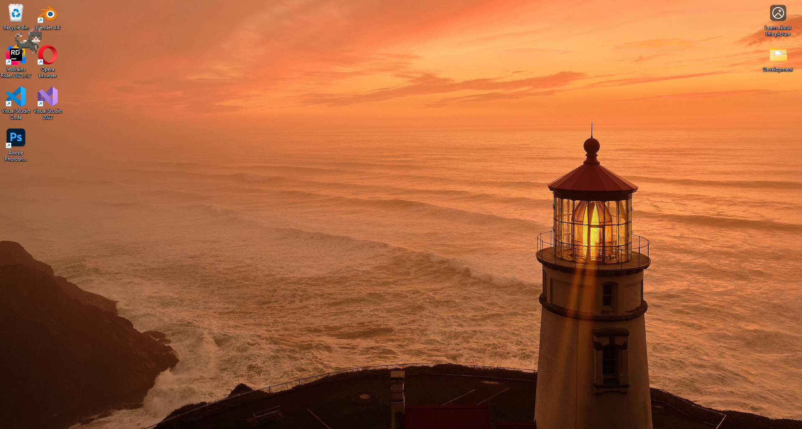
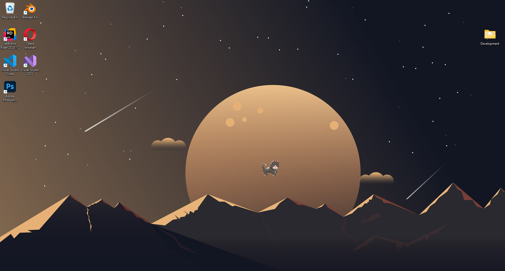

# SDL Transparent Desktop Renderer

This project demonstrates how to create a transparent, always-on-top, click-through SDL2 renderer window that is visually "hooked" to the Windows desktop. The window is parented to the desktop's WorkerW window, allowing rendered content to appear as if it is part of the desktop background, while remaining interactive and non-intrusive.

## Features

- SDL2-based rendering on the Windows desktop
- Transparent, borderless, and click-through window
- Window is parented to the desktop to persistanty render over the desktop
- System tray icon with context menu for easy exit
- Example usage: renders a sample image, but can be adapted for any SDL2 rendering

## Screenshots


*Image rendered in top left of screen*

*Image rendered in center of the screen*

## Requirements

- Windows 10 or later
- [SDL2](https://www.libsdl.org/) (development libraries)
- [SDL2_image](https://www.libsdl.org/projects/SDL_image/) (development libraries)
- Visual Studio 2022 or any C++14-compatible compiler

## Building

1. Clone the repository:
    ```sh
    git clone https://github.com/manzi-labs/SDL-Desktop-Renderer-Example.git
    ```
2. Open the solution in Visual Studio.
3. Ensure SDL2 and SDL2_image development libraries are installed and referenced in your project settings.
4. Build the solution.

## Usage

- Place an image at `Resources/Spritesheets/spitesheet_01.png` or update the path in `main.cpp` to your preferred image.
- Run the application. The image will be rendered as part of the desktop.
- Use the system tray icon to exit the application.

## Customization

- Replace the example image and rendering code with your own SDL2 drawing logic.
- The renderer can be used for widgets, overlays, or any custom desktop graphics.

## License

MIT License. See [LICENSE](LICENSE) for details.

---

*This project is a minimal example for advanced SDL2 rendering on the Windows desktop.*
